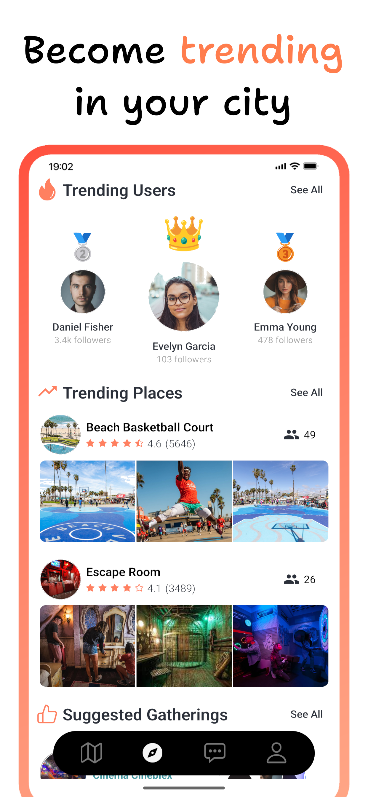
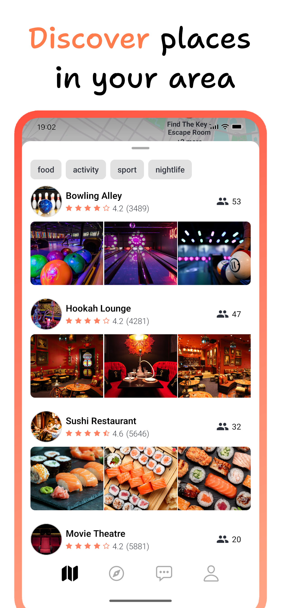
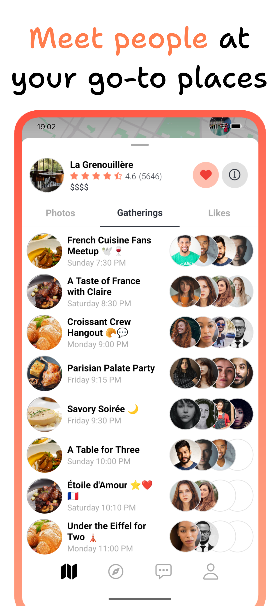

# 🌟 Gathera

> Connect with people through places, discover your city through its people.

Gathera is a dynamic social networking platform that reimagines how people connect in the real world. By combining location-based discovery with social networking, Gathera creates meaningful connections through shared experiences at real places.

## 🎯 Vision

We believe the best connections happen in person, and the most memorable experiences are tied to places. Gathera bridges the gap between digital social networking and real-world interactions, making it easier than ever to meet people who share your interests at places you love.

## ✨ Key Features

### 🗺️ Location-Based Discovery

- Find exciting places in your area
- See real-time gatherings happening nearby
- Discover trending locations through local community engagement

### 👥 Social Networking

- Connect with people who share your interests
- Follow local influencers and tastemakers
- Build your network through shared experiences

### 🎉 Gatherings

- Create and join gatherings at your favorite spots
- Real-time chat with gathering participants
- Track past gatherings and build your social history

### 🧭 City Guide

- Explore new cities through the eyes of locals
- Find popular spots through community-driven insights
- Follow local trendsetters for authentic recommendations

## 📸 Screenshots

### Mobile App

<div align="center">
  <table>
    <tr>
      <td align="center">
        <br>
        <b>Discover</b>
      </td>
      <td align="center">
        <br>
        <b>Places</b>
      </td>
      <td align="center">
        <br>
        <b>Place Gatherings</b>
      </td>
    </tr>
  </table>

  <table>
    <tr>
      <td align="center">
        <br>
        <b>Chat</b>
      </td>
      <td align="center">
        <br>
        <b>Gathering</b>
      </td>
      <td align="center">
        <br>
        <b>Profile</b>
      </td>
    </tr>
  </table>
</div>

## 🛠️ Technology

Gathera is built with modern technologies to ensure a seamless and responsive experience:

- **Backend**: Node.js/Express with TypeScript
- **Mobile**: React Native with Expo
- **Real-time**: WebSocket communication
- **Location**: Google Maps integration
- **Storage**: MongoDB & AWS S3
- **Authentication**: Phone number verification via Twilio

## 📱 Platform Support

- iOS (App Store)
- Android (Play Store)

## 🔍 Project Structure

```
gathera/
├── backend/          # Node.js/Express backend service
└── mobile/           # React Native mobile application
```

For detailed setup and development instructions, see:

- [Backend Documentation](backend/README.md)
- [Mobile App Documentation](mobile/README.md)

## 🚀 Getting Started

1. Clone the repository
2. Set up the backend services (see backend README)
3. Configure the mobile application (see mobile README)
4. Start exploring and contributing!

## 📄 License

Copyright (c) 2025 Younes Benketira

This project is licensed under the BSD 3-Clause License - see the [backend/README.md#license](backend/README.md#license) file for details.
